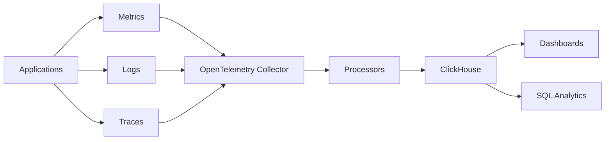

# Architecture

```mermaid
flowchart LR

A[Applications]

A --> B[Metrics]

A --> C[Logs]

A --> D[Traces]

B --> E[OpenTelemetry Collector]

C --> E

D --> E

E --> F[Processors]

F --> G[ClickHouse]

G --> H[Dashboards]

G --> I[SQL Analytics]
```
